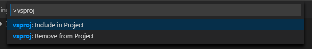
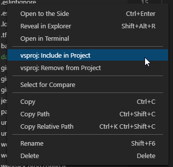

# VS Code `.*proj` Extension

This extension will helps you keep your *proj files in sync when using VS Code.
This is useful if you work in a team that uses both VS Code and Visual Studio.

## Configuration

This extension needs a __Visual Studio Code Workspace__ in order to be activated.

The workspace should contain :

```javascript
"settings": {
   "vsproj": {
      //Must be true to be activated on the current workspace
      "activate": true,
      //List of RegEx to exclude some files
      "exclude": []
   }
}
```

If the extension is activated for the workspace, you can see this in the status bar :


## How it Works

When you switch to or create/update/delete a file/folder, it will find the nearest  `.*proj` up the file system tree, and update it depending on the action you've done.

You can add/remove a file or folder to vsproj via the command palette (recursively) :



Or via the context menu in the file explorer:



## Extension Settings

This extension contributes the following settings:

| **Setting Key**         | **Description**
|-------------------------|-----------------
| `vsproj.enable`         | Enable/disable this extension globally.
| `vsproj.projExtension`  | VS project file to watch and update. Defaults: "njsproj"
| `vsproj.itemType`       | Mapping from file extension to vsproj XML element. Defaults to: <br/> `{ "*": "Content", ".ts": "TypeScriptCompile" }`
| `vsproj.includeRegex`   | Regular expression to match files you want to add to vsproj.
| `vsproj.excludeRegex`   | Regular expression to exclude files you do not want to add to vsproj.


These regular expressions will prevent unwanted files to be added in the _proj_ file. If a file matches `includeRegex` *and* `excludeRegex`, it will be excluded.

You can also ignore files by workspace with the `exclude` setting described above.

## Links

* [GitHub Repository](https://github.com/jRichardeau/vscode-vsproj)

## FORKED FROM :

* [GitHub Repository](https://github.com/azz/vscode-csproj)
* [Marketplace Entry](https://marketplace.visualstudio.com/items?itemName=lucasazzola.vscode-csproj)


## Release Notes

### Most Recent Release (1.0.3)

Features:

* Need a workspace configuration to activate and constraint the folders
* All prompts have been removed
* Work when creating folders
* Work when moving files/folders
* Work when renaming file/folder
* Work when removing files/folders

### See GitHub for [full release history](https://github.com/jRichardeau/vscode-vsproj/releases)

### Known Issues

* Renaming file or folder and changing only case will create a second entry with the new file/folder name without removing the previous.
* Encoding of _proj_ file is only ASCII

## License

MIT
